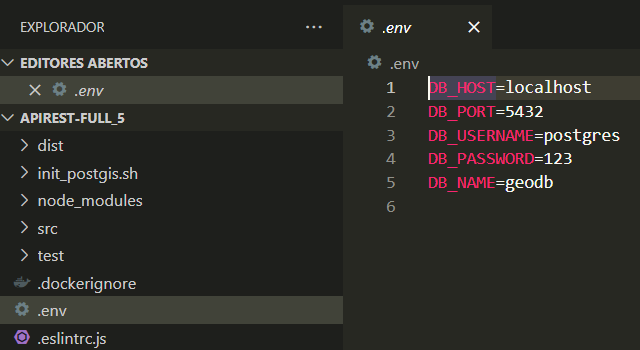

# API RESTful 


## Recursos Utilizados
Node.js<br>
TypeScript <br>
NestJS<br>
PostgreSQL<br>
PostGIS<br>
Docker<br>
Jest

## Descrição
API RESTful com as funcionalidades CRUD.


## Como executar 

### Altere as credenciais de conexão com o banco de dados no seguinte arquivo: .env


```bash


# instale os pacotes com o seguinte comando:
$ npm install

# inicie o seguinte comando para criar o arquivo .env com as credenciais de conexão com o banco:
$ "DB_HOST=localhost`nDB_PORT=5432`nDB_USERNAME=usuario`nDB_PASSWORD=senha`nDB_NAME=nome_do_banco" | Out-File -FilePath .env -Encoding utf8

# apos a instalação e configuração, execute o comando:
$ npm run start

```

### Obs: caso o arquivo .env não seja criado, crie-o manualmente e preencha as credenciais:

DB_HOST=localhost<br>
DB_PORT=5432<br>
DB_USERNAME=usuario<br>
DB_PASSWORD=senha<br>
DB_NAME=nome_do_banco<br>

### exemplo:



## Rotas
### As rotas abaixo podem ser executadas no Postman

http://localhost:3000/usuarios <br>
http://localhost:3000/pontos-de-interesse <br>
http://localhost:3000/categorias/ <br>


Usuários: <br>
GET /usuarios — Listar todos os usuários.<br>
POST /usuarios — Criar um novo usuário.<br>
PUT /usuarios/id — Atualizar um usuário.<br>
DELETE /usuarios/id — Excluir um usuário.<br>

Categorias:<br>
GET /categorias — Listar todas as categorias.<br>
POST /categorias — Criar uma nova categoria.<br>
PUT /categorias/id — Atualizar uma categoria.<br>
DELETE /categorias/id — Excluir uma categoria.<br>

Pontos de Interesse:<br>
GET /pontos-de-interesse — Listar todos os pontos de interesse.<br>
POST /pontos-de-interesse — Criar um novo ponto de interesse.<br>
PUT /pontos-de-interesse/id — Atualizar um ponto de interesse.<br>
DELETE /pontos-de-interesse/id — Excluir um ponto de interesse.<br>

## Json
### API já vem com dados cadastrados, porém abaixo estão os arquivos JSON dos dados inseridos. As estruturas podem ser usadas para testar a inserção de novos dados.

#### usuarios.json

{
  "usuarios": [
    {
      "nome": "João Silva",
      "email": "joao.silva@example.com"
    },
    {
      "nome": "Maria Oliveira",
      "email": "maria.oliveira@example.com"
    }
  ]
}

#### categorias.json

{
  "categorias": [
    {
      "nome": "Parques"
    },
    {
      "nome": "Museus"
    }
  ]
}

#### pontos_de_interesse.json

{
  "pontos_de_interesse": [
    {
      "nome": "Parque Central",
      "localizacao": {
        "type": "Point",
        "coordinates": [-46.633309, -23.55052]
      },
      "categoriaId": 1
    },
    {
      "nome": "Museu de Arte Moderna",
      "localizacao": {
        "type": "Point",
        "coordinates": [-42.651023, -27.556561]
      },
      "categoriaId": 2
    }
  ]
}

## Docker

para testar no docker, execute o seguinte comando:


```bash

$ docker-compose up --build

```

## Testes utilizando Jest

```bash
# Para executar os testes, primeiro será necessário inicializar utilizando o seguinte comando:
$ npm run start

# Isso criará automaticamente o banco de dados, as tabelas e alguns dados. Após verificar que tudo foi criado corretamente, execute o seguinte comando para iniciar os testes:

$ npm run test:e2e
